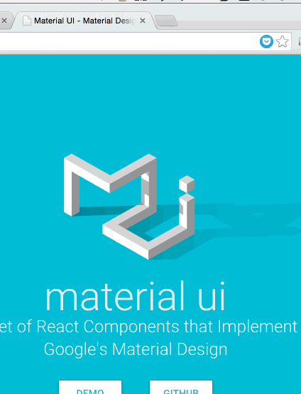

## BookPocket

BookPocket is a Chrome extension, which allows you to bookmark your web pages to Pocket.

## Demo



## How to build

BookPocket requires [npm](https://www.npmjs.com/) to install library dependencies, and [gulp](http://gulpjs.com/) for building tasks.

```
$ cd bookpocket
$ npm instsall
$ gulp
```

To build the production version which files are minified, just replace `gulp` with `gulp prod` in the last step.

## License

BookPocket is released under the [MIT license](http://www.opensource.org/licenses/MIT).
